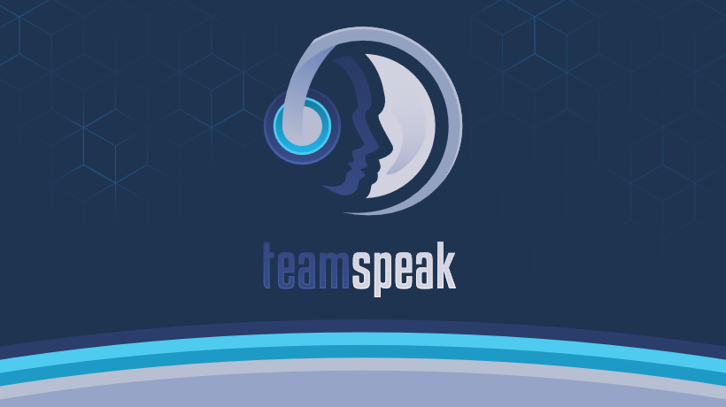

(Copyright: https://teamspeak.com)
 
 

# TS3-NodeJS-Fullstack by devusSs

## Project Explaination

This project serves the point of collecting, distributing and showing data collected on your TeamSpeak server so you can always keep track of users, commands (via the Bot) and messages sent on your server. 
Considering not every user may accept being tracked across your server you may want to notice them in advance or when joining your TeamSpeak server that your server is being monitored and you (as the server owner) may always check the data.

## Project Warning

This project has not been entirely finished yet, for example it's lacking authorization on the API and basically any user with the frontend's url may access the data. Use it with caution or behind ip filtering (dynamic ip filtering via hostnames for example). 
There may also be bugs and unwanted features which cannot be fixed or disabled yet.

## Project Structure

The project consists of three key elements:

- the Bot which collects data from the TeamSpeak 3 server and adds it to a Postgres database
- the API which distributes data from a Postgres database
- the Client which displays the data via web

Everything has been written in Typescript and should be typesafe, there are however element which have no valid types yet so expect bugs.

## Project Setup

Check the .env.example files in the bot's, api's and client's directory to find out how to setup the project. 
Docker support has not been added yet but will be added in the future so you can start the application with a single command.
For now you may need to use node in every directory. Check the package.json in every directory to find out more.
 
 
 

# DISCLAIMER

Read the following disclaimers carefully before using this software:

- This software IS NOT INTENDED FOR PRODUCTION USE.
- I am in no way responsible for any damage this software might cause. USE AT YOUR OWN RISK.

## Built With / Frameworks

- [NodeJS](https://nodejs.org/) - Javascript Runtime
- [Typescript](https://www.typescriptlang.org/) - Types for Javascript
- [ExpressJS](https://expressjs.com/) - API framework for Typescript / Javascript
- [TS3-NodeJS-Library](https://github.com/Multivit4min/TS3-NodeJS-Library) - TeamSpeak 3 Query framework for Typescript / Javascript
- [Vite ReactJS](https://vitejs.dev/guide/) - Vite React JS Frontend

## Authors

- **Florian Försterling** - [devusSs](https://github.com/devusSs)
